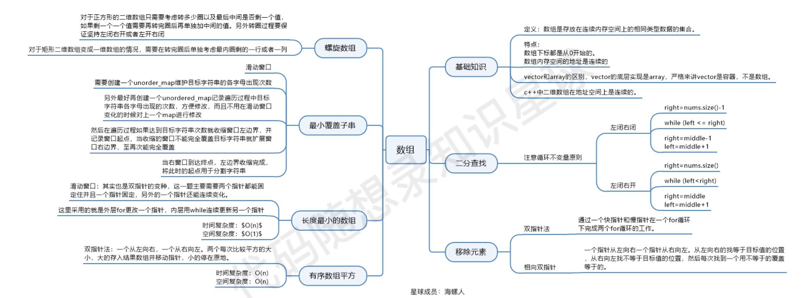
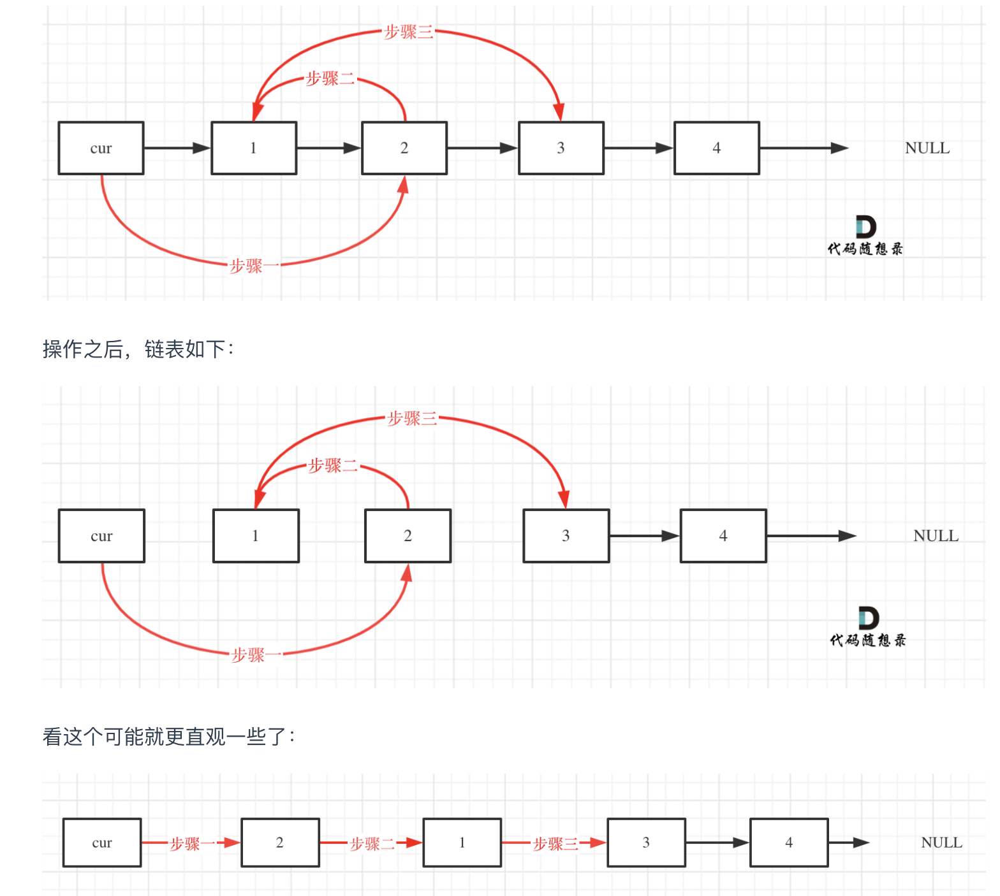
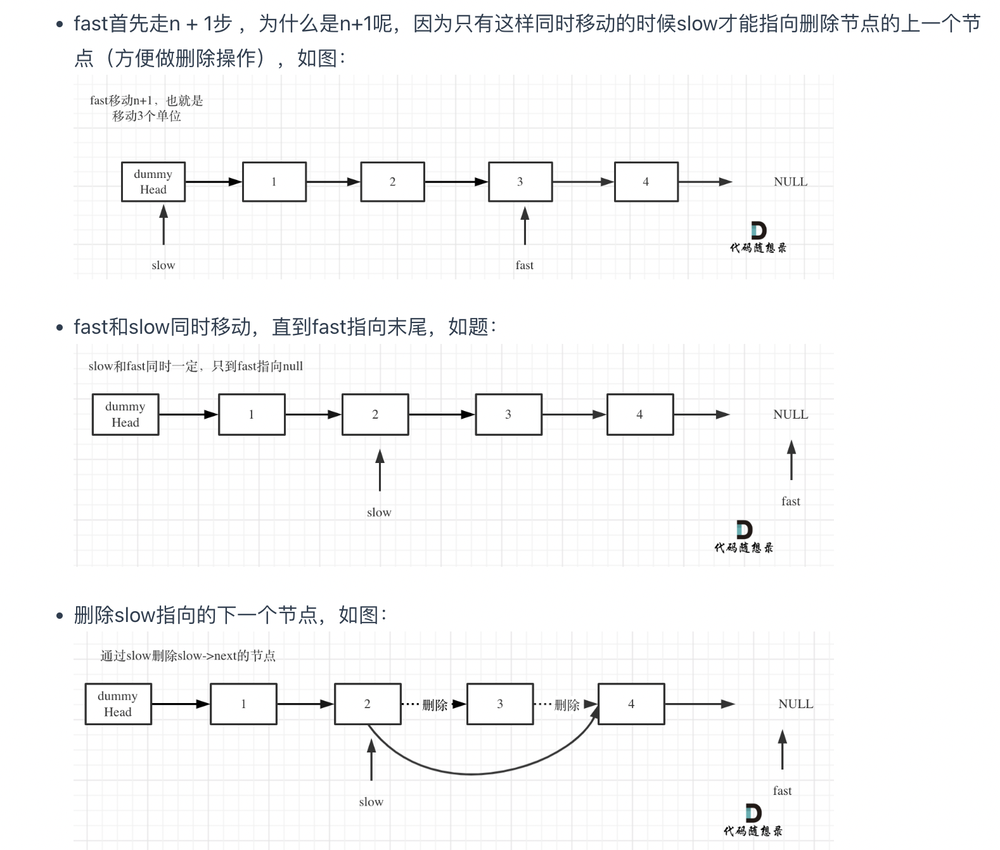
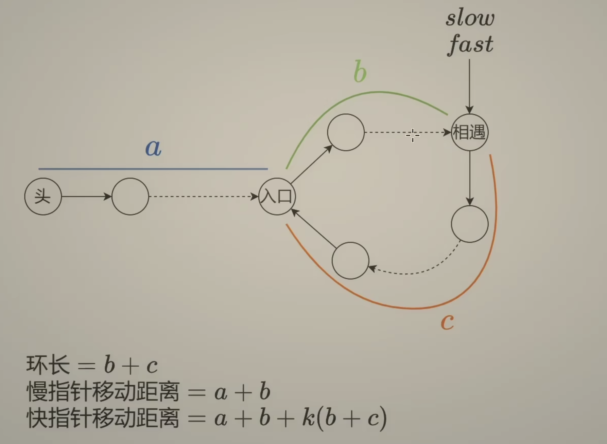
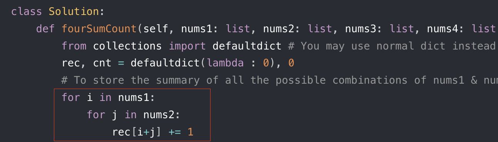
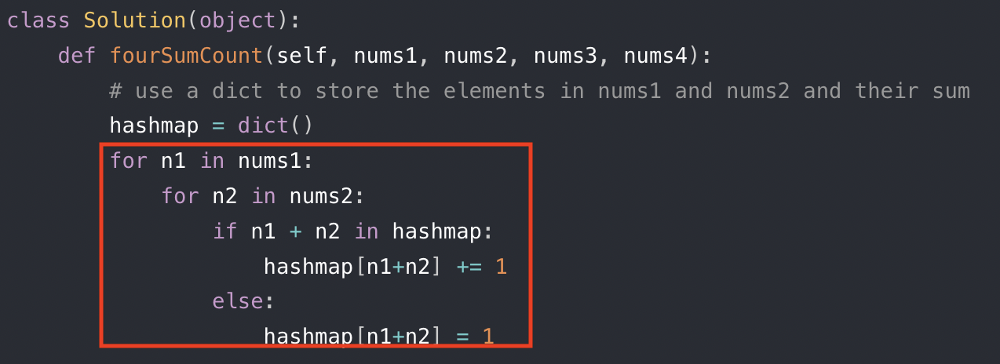
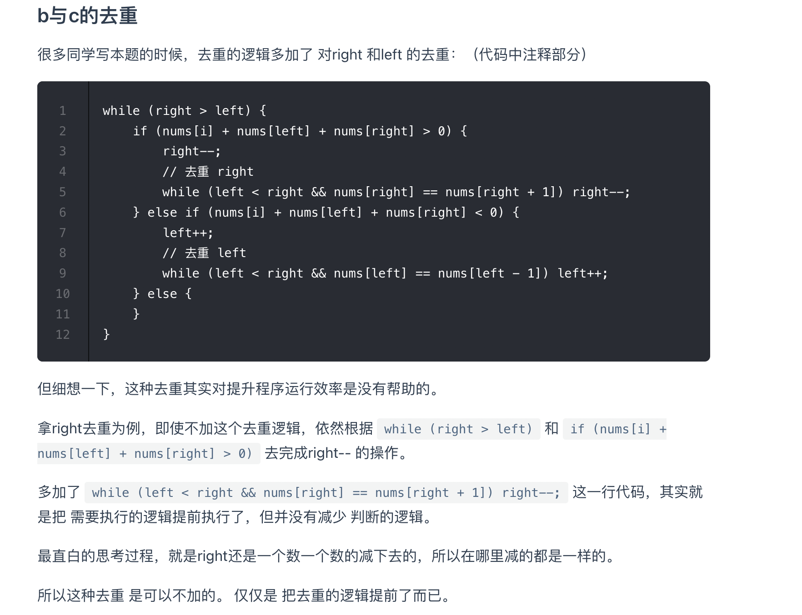

# LeetCode

LeetCode刷题记录，记录代码和做题思路。

## 算法训练营

## 第一天: 704. 二分查找，35\. 搜索插入位置, 34\. 在排序数组中查找元素的第一个和最后一个位置, 27. 移除元素
- [二分查找](src/binarysearch)
    - 704\. 基本的二分查找问题: [`704左闭右闭左闭右开.py`](src/binarysearch/704左闭右闭左闭右开.py)
    - 思路： 左闭右闭， 左闭右开，左开右开模版, l + (r-l)//2 python中//运算符向下取整, 避免越界
    - 
    - 35\. 搜索插入位置：[`LC35.py`](src/binarysearch/LC35.py)
    - 思路：左闭右闭模版，终止时 R 在 L 左边， R + 1 = L，return L 或者 R+1 都行
    - 
    -
    - 34\. 在排序数组中查找元素的第一个和最后一个位置: [`LC34.py`](src/binarysearch/LC34.py)
    - 思路：左闭右闭模版，四种情况的转换
    - 
    - 

    - 27\. 移除元素:[`LC27.py`](src/twopointer/LC27.py)
    - 思路 双指针，快慢指针，快指针遍历数组，如果快指针发现不等于val的数，慢指针覆盖快指针指向的数，
    - 慢指针只有执行了覆盖后才+1，快指针无论如何都+1

## 第二天: 977.有序数组的平方 ，209.长度最小的子数组 ，59.螺旋矩阵II 
- [双指针](src/twopointer)，滑动窗口(同向双指针）
  - 977\.有序数组的平方 [`LC977.py`](src/twopointer/LC977.py)
  - 思路：数组有序排序，有负数也有正数，因此平方后的最大值应当从数组两端开始取，因此利用双指针，
  - 一个指向数组的开头，一个指向结尾，同时向内缩小，若开头的平方值大于末尾，则将该数放置新数组的末尾，并且使得ｋ-=1，left+=1，
  - 同理若开头平方值小于末尾，则ｋ-=1，right+=1
  - 最后当左右端的指针相遇后，即ｉ＞ｊ时退出循环
  - 
  - 209\.长度最小的子数组 [`LC209.py`](src/twopointer/LC209.py)
  - 窗口内是什么？满足其和 ≥ s 的长度最小的 连续 子数组。
  - 如何移动窗口的起始位置？ 如果当前窗口的值大于s了，窗口就要向前移动了（也就是该缩小了）。
  - 如何移动窗口的结束位置？ 窗口的结束位置就是遍历数组的指针，也就是for循环里的索引。
  - 从满足条件不断缩小起始位置left直到不满足条件，满足条件时不断更新ans直到找到最小值
  - 
  - 713\.乘积小于 K 的子数组[`LC713.py`](src/twopointer/LC713.py)
  - 区别于209，本题从不满足条件不断缩小起始位置left直到满足条件，满足条件后在 循环外 更新 ans+= r-l+1
  - 窗口内是什么？满足其乘积 ≥ k 的 连续子数组，求 <k 的连续子数组
  - 对于每一个窗口结束位置right（for 遍历数组），其窗口开始位置left不断缩小直到满足其乘积 <k
  -                                                       
  - 3\.无重复字符的最长子串
  - 59\.螺旋矩阵II[`LC59.py`](src/twopointer/LC59.py) 
  - 参考K神题解，左右上下右左下上，左到右缩进上，上到下缩进右，右到左缩进下，下到上缩进左
  - 从左向右填充：填充的列在[left,right+1) / [left,right] 区间,    填充完后 top  +=1，向下移，缩小上边界
  - 从上向下填充：填充的行在[top, bottom+1）/ [top,bottom]区间 ,   填充完后  right -=1，向左移，缩小右边界
  - 从右向左填充：填充的列在[right,left-1，-1) / [right,left]区间，此项为反向填充，填充完后 bottom -=1，向上移，缩小下边界                              
  - 从下向上填充：填充的行在[bootom,top-1，-1）/ [bottom,top]区间 , 此项为反向填充，填充完后 left +=1，向右移， 缩小左边界  
  -    
  -  
  -  54\.螺旋矩阵II[`LC54.py`](src/twopointer/LC54.py)
  -  循环逻辑相同，count = 1 则循环条件 count <= target，count = 0 则 count < target
  -  但需要先判断是否count <= target 在更新result和count+=1

  

## 思维导图总结                                                
  -                                                          
                                                         
                                                         

## 第三天  链表理论基础， 203.移除链表元素， 707.设计链表， 206.反转链表
- 203.移除链表元素 [`LC203.py`](src/LinkedList/LC203.py)
- 使用dummy_head使后面的删除操作统一，cur 指向dummy_head 并return dummy_head.next （原头节点）
- 使用while 循环因为要一直判断，每次循环判断cur 是否为空 以及 cur.next是否为空
- 删除操作 cur.next = cur.next.next， 不删除 cur = cur.next
- 
- 707.设计链表 [`LC707.py`](src/LinkedList/LC707.py)
- 206.反转链表 [`LC206.py`](src/LinkedList/LC206.py)
- 94.反转链表II
- 双指针法 pre cur，while cur ！= None：读取 nxt， 更新cur.next，更新 pre，cur = cur，nxt
- 递归法，递归变量 reverse（pre，cur） -》 reverse（cur，nxt）

## 第四天  24. 两两交换链表中的节点， 19.删除链表的倒数第N个节点， 面试题 02.07链表相交， 142.环形链表II 
- 24.两两交换链表中的节点 [`LC24.py`](src/LinkedList/LC24.py)
- [思路 LC24 Swap Nodes in Pairs.pdf](src/LinkedList/LC24%20Swap%20Nodes%20in%20Pairs.pdf)
- 
- # 链表双指针：快慢指针
- 19.删除链表的倒数第N个节点 [`LC19.py`](src/LinkedList/LC19.py)
- [思路 LC19 Remove Nth Node From End of List.pdf](src/LinkedList/LC19.%20Remove%20Nth%20Node%20From%20End%20of%20List.pdf)
- 
- 876\. 链表的中间结点 [`LC876.py`](src/LinkedList/LC876.py)
- 奇数时快指针走到null前一位（链表末位），慢指针刚好到中间
- 偶数时快指针走到null上，慢指针刚好到中间
- 
- 141\. 环形链表:[`LC141.py`](src/LinkedList/LC141.py)
- 注意快指针走两步，会走到null上 或者null前一位（链表末位） 循环条件为 fast ！= None and fast.next ！== None
- 
- 142\. 环形链表II:[`LC142.py`](src/LinkedList/LC142.py)
- 
- [思路 LC142 LinkedList Cycle II.pdf](src/LinkedList/LC142%20Linked%20List%20Cycle%20II.pdf)
- 在141的基础上再添加两个指针index1（相遇）和 index2（头）
- 当快慢指针相遇时记录相遇index1，同时让index1（相遇）和 index2（头）同时向前走一步
- 当index1（相遇）和 index2（头）相遇时即为环的入口

## 第六天 哈希表  1. 两数之和 242.有效的字母异位词  383. 赎金信  349. 两个数组的交集
- 1\.两数之和：[`twosum.py`](src/HashTable/twosum.py)
- 梦开始的地方， key 存数组元素的数值，value存对应的下标index
- 判断 if target-nums 在hashmap中，如果在则返回 hashtable【target-nums】（下标），i （下标）
- 
- 242\.有效的字母异位词:[`LC242.py`](src/HashTable/LC242.py)
- 383\.赎金信:[`LC383.py`](src/HashTable/LC383.py)
- 两道题套路相同，都是只有26个小写字母（很重要！！）， 所以才能用ACSII，
- 先创建一个list长度为26，hashmap = 【0】*26
- 遍历第一个数组，hashmap[ord(i)-ord('a')]+=1,key：ord(i)-ord('a') 对应0，1，2，3，4...26，代表a,b,c,d,...z
- value:代表对应字母出现次数
- 再遍历第二个数组，hashmap[ord(j)-ord('a')]-=1，减去当前哈希表里对应字母出现次数
- 遍历26个字母，for i in range（26），hashmap【i】根据题意对每个字母出现次数做判断
- 
- 349\. 两个数组的交集[`LC349.py`](src/HashTable/LC349.py)
- 创建hashmap，遍历第一个数组，key为数值，value 为1 （value为啥不重要，不等于0就行）
- 遍历第二个数组，使用 if hashmap.get(num)，如果返回True 则添加结果并且让 对应数值的value变成0
- if hashmap.get(num):hashmap[num] = 0，目的是用0代表该数字使用过了，去重
- if function 如果 = 0， if hashmap.get(num) = 0，会返回false，从而不执行if后面的的，达到去重的目的
- python一行解：return list(set(nums1) & set(nums2))，注意要返回list 否则报错
  
## 第七天 202.快乐数 454.四数相加II 15. 三数之和 18. 四数之和
- 454\.四数相加II[`LC454.py`](src/HashTable/LC454.py)
- 首先定义 一个unordered_map，key放a和b两数之和，value 放a和b两数之和出现的次数。
- 遍历大A和大B数组，统计两个数组元素之和，和出现的次数，放到map中。
- 定义int变量count，用来统计 a+b+c+d = 0 出现的次数。
- 在遍历大C和大D数组，找到如果 0-(c+d) 在map中出现过的话，就用count把map中key对应的value也就是出现次数统计出来。
- count += hashtable【0-(c+d)】注意不是+=1，加的是出现次数，map中key对应的value
- 注意collections defalultdict 和 dict的区别
- defalultdict可以无中生有一个key，对应value为int
- dict需要先判断key是否存在在hashtable中
-  
-  
-  
-  202\.快乐数[`LC202.py`](src/HashTable/LC202.py)
-  求n的各个位数的平方和，先对n模10，取余数，余数即是个位上的数 +=（n%10）**2
-  再对 n = n //10 向下取整，原先十位数移到了个位数上，直到 n = 1，2，3..9，n小于10， 1,2,3,4...9//10 = 0
-  while n 循环条件为 n 不等于0， n 小于10 //10 = 0
-  哈希表判断快乐数是否出现在表里（是否循环）如果在 if n in record： return False，否则把n加入哈希表
-  本题使用set，加入哈希表的方法为 set.add（n）
-  
-  15\. 三数之和 [`LC15.py`](src/twopointer/LC15.py)
-  必须先将给定 nums 排序！复杂度为O(NlogN)。nums.sort（）
-  三个指针k，left，right，对应值 a，b，c
-  固定3个指针中最左（最小）数字的指针 k，双指针left，right 为k+1，len（nums）-1
-  通过双指针交替向中间移动，记录a + b + c == target的组合
-  去重！！if k > 0 and nums【k】==nums【k-1】：continue （使用continue跳到下一个k）
-  永远用k和k-1对比，如果k和k+1比， 会错过 【-1，-1，2】==0 这种组合（第二个-1会被跳过）
-  对比回溯的树枝去重和树冠去重，这里进行的是树冠去重
-  循环条件 while left < right，如果left = right，left和right共同指向一个数
-  s = a + b +c if s > target，right--； if s < target， left++
-  收集结果时去重 先更新指针left++ right--
-  再判断left 和 left-1，left++； right 和 right+1，right--
-  
-  
-  18\. 四数之和 [`LC18.py`](src/twopointer/LC18.py)
-  四数之和在三数基础上再套一层for循环，四个指针，初始化：k（0），i（k+1），left（i+1），right（n-1）
-  k 和 i 都进行去重
-  k去重！！if k > 0 and nums【k】==nums【k-1】：continue
-  i去重！！if i > k+1 and nums【i】==nums【i-1】：continue
-  因为i和i-1比，i-1最小为k，所以要判断 i大于k+1

## 第八天 344.反转字符串 541. 反转字符串II 剑指Offer 05.替换空格 151.翻转字符串里的单词 剑指Offer58-II.左旋转字符串
- [string和list的切割](src/slice)
- 344.反转字符串（双指针）[`LC541.py`](src/twopointer/LC344.py)
- s.reverse() 原s上修改
- s[:]=s[::-1] 表示将原数组反转后赋值给s中每一个对应的位置 
- s[::-1]表示反转s中的元素
- s[:]表示数组中所有子模块
- s = s[::-1] 报错， 会创建一个新s并把翻转的值赋给新的s
- 
- 541\. 反转字符串II (双指针）[`LC541.py`](src/twopointer/LC541.py)
- 先要将s转换为list，s = list（s）否则无法执行双指针赋值操作 s[left] = s[right]
- 因为在 Python 和 Java 等语言中，字符串都被设计成「不可变」的类型
- return “”.join(s)
- 对于字符串s = 'abc'，如果使用s[0:999] ===> 'abc'。
- 字符串末尾如果超过最大长度，则会返回至字符串最后一个值，这个特性可以避免一些边界条件的处理。
- 用切片整体替换，而不是一个个替换.

- 剑指Offer 05.替换空格 [`replaceSpace.py`](src/offer/replaceSpace.py)
- 在 Python 和 Java 等语言中，字符串都被设计成「不可变」的类型，即无法直接修改字符串的某一位字符，需要新建一个字符串实现。 
- 遍历列表 s 中的每个字符 c ：当 c 为空格时：向 res 后添加字符串 "%20" ；当 c 不为空格时：向 res 后添加字符 c
- if c == " " (打一个空格在括号中间）
- return “”.join(res)
- 
- 151.翻转字符串里的单词
- 
- 剑指Offer58-II.左旋转字符串 [`reverseLeftWords.py`]src/twopointer/reverseLeftWords.py

    
                    以下为fork 内容，仅做参考
    -------------------------------------------------------------------
   - 69\. 求 x 的开方: [`SquareX_69.java`](src/binarysearch/SquareX_69.java)
   - 744\. 寻找比目标字母大的最小字母: [`FindSmallestLetterGreaterThanTarget_744.java`](src/binarysearch/FindSmallestLetterGreaterThanTarget_744.java)
   - 540\. 有序数组中的单一元素: [`SingleElementinASortedArray_540.java`](src/binarysearch/SingleElementinASortedArray_540.java)
   - 153\. 寻找旋转排序数组中的最小值: [`FindMinimumInRotatedSortedArray_153.java`](src/binarysearch/FindMinimumInRotatedSortedArray_153.java)
   
    
- [双指针](src/twopointer)
    - 167\. 两数之和 II - 输入有序数组: [`TwoSumII_167.java`](src/twopointer/TwoSumII_167.java) 
    - 633\. 平方数之和: [`SumOfSquareNumbers_633.java`](src/twopointer/SumOfSquareNumbers_633.java)
    - 345\. 反转字符串中的元音字母: [`ReverseVowelsofAString_345.java`](src/twopointer/ReverseVowelsofAString_345.java)
    - 680\. 验证回文字符串 Ⅱ: [`ValidPalindromeII_680.java`](src/twopointer/ValidPalindromeII_680.java)
    - 88\. 合并两个有序数组: [`MergeSortedArray_88.java`](src/twopointer/MergeSortedArray_88.java)
    - 141\. 环形链表: [`LinkedListCycle_141.java`](src/twopointer/LinkedListCycle_141.java)
    - 392\. 判断子序列: [`IsSubsequence_392.java`](src/twopointer/IsSubsequence_392.java)
    - 524\. 通过删除字母匹配到字典里最长单词: [`LongestWordInDictionaryThroughDeleting_524.java`](src/twopointer/LongestWordInDictionaryThroughDeleting_524.java)
    - 11\. 盛最多水的容器: [`ContainerWithMostWater_11.java`](src/twopointer/ContainerWithMostWater_11.java)
    
- [排序](src/sort)
    - 经典排序算法: [`Sort.java`](src/sort/Sort.java)
        - 冒泡排序: `bubbleSort`
        - 选择排序: `selectSort`
        - 插入排序: `insertSort`
        - 归并排序: `mergeSort`
        - 快速排序: `quickSort`
        - 堆排序: `heapSort`
        - 计数排序: `countSort`
    - 215\. 数组中的第K个最大元素: [`KthLargestElementInAnArray_215.java`](src/sort/KthLargestElementInAnArray_215.java)
    - 347\. 前 K 个高频元素: [`TopKFrequentElements_347.java`](src/sort/TopKFrequentElements_347.java)
    - 451\. 根据字符出现频率排序: [`SortCharactersByFrequency_451.java`](src/sort/SortCharactersByFrequency_451.java)
    - 75\. 颜色分类: [`SortColors_75.java`](src/sort/SortColors_75.java)
    
- [贪心算法](src/greedy)
    - 经典贪心问题: [`Greedy.java`](src/greedy/Greedy.java)
    - 455\. 分发饼干: [`AssignCookies_455.java`](src/greedy/AssignCookies_455.java)
    - 435\. 无重叠区间: [`NonOverlappingIntervals_435.java`](src/greedy/NonOverlappingIntervals_435.java)
    - 452\. 用最少数量的箭引爆气球: [`MinimumNumberOfArrowsToBurstBalloons_452.java`](src/greedy/MinimumNumberOfArrowsToBurstBalloons_452.java)
    - 406\. 根据身高重建队列: [`QueueReconstructionByHeight_406.java`](src/greedy/QueueReconstructionByHeight_406.java)
    - 121\. 买卖股票的最佳时机: [`BestTimeToBuyAndSellStock_121.java`](src/greedy/BestTimeToBuyAndSellStock_121.java)
    - 122\. 买卖股票的最佳时机 II: [`BestTimeToBuyAndSellStockII_122.java`](src/greedy/BestTimeToBuyAndSellStockII_122.java)
    - 605\. 种花问题: [`CanPlaceFlowers_605.java`](src/greedy/CanPlaceFlowers_605.java)
    - 860\. 柠檬水找零: [`LemonadeChange_860.java`](src/greedy/LemonadeChange_860.java)
    - 874\. 模拟行走机器人: 
        - OOP: [`WalkingRobotSimulationOOP_874.java`](src/greedy/WalkingRobotSimulationOOP_874.java)
        - 面向过程: [`WalkingRobotSimulation_874.java`](src/greedy/WalkingRobotSimulation_874.java)
    - 665\. 非递减数列: [`NonDecreasingArray_665.java`](src/greedy/NonDecreasingArray_665.java)
    
- [二分查找](src/binarysearch)
    - 704\. 基本的二分查找问题: [`BinarySearch_704.java`](src/binarysearch/BinarySearch_704.java)
    - 69\. 求 x 的开方: [`SquareX_69.java`](src/binarysearch/SquareX_69.java)
    - 744\. 寻找比目标字母大的最小字母: [`FindSmallestLetterGreaterThanTarget_744.java`](src/binarysearch/FindSmallestLetterGreaterThanTarget_744.java)
    - 540\. 有序数组中的单一元素: [`SingleElementinASortedArray_540.java`](src/binarysearch/SingleElementinASortedArray_540.java)
    - 153\. 寻找旋转排序数组中的最小值: [`FindMinimumInRotatedSortedArray_153.java`](src/binarysearch/FindMinimumInRotatedSortedArray_153.java)
    - 34\. 在排序数组中查找元素的第一个和最后一个位置: [`FindFirstAndLastPositionOfElementInSortedArray_34.java`](src/binarysearch/FindFirstAndLastPositionOfElementInSortedArray_34.java)

- [分而治之](src/divideconquer)
    - 241\. 为运算表达式设计优先级: [`DifferentWaysToAddParentheses_241.java`](src/divideconquer/DifferentWaysToAddParentheses_241.java)
    - 95\. 不同的二叉搜索树 II: [`UniqueBinarySearchTreesII_95.java`](src/divideconquer/UniqueBinarySearchTreesII_95.java)

- [搜索](src/search)
    - BasicSearch: [`BasicSearch.java`](src/search/BasicSearch.java)
        - 广度优先搜索（BFS）算法：`breadthFirstSearch`
        - 深度优先搜索（DFS）算法：`depthFirstSearch`
        - 最短路径算法：`shortestPath`
    - BFS: 图的遍历与最短路径问题
        - 1091\. 二进制矩阵中的最短路径: [`ShortestPathInBinaryMatrix_1091.java`](src/search/ShortestPathInBinaryMatrix_1091.java)
        - 279\. 完全平方数: [`PerfectSquares_279.java`](src/search/PerfectSquares_279.java)
        - 127\. 单词接龙: [`WordLadder_127.java`](src/search/WordLadder_127.java)
    - DFS: 图的连通性问题（存在一条连通的路径问题）
        - 695\. 岛的最大面积: [`MaxAreaOfIsland_695.java`](src/search/MaxAreaOfIsland_695.java)
        - 200\. 岛屿数量: [`NumOfIslands.java`](src/search/NumOfIslands.java)
        - 547\. 朋友圈: [`FriendCircles_547.java`](src/search/FriendCircles_547.java)
        - 130\. 被围绕的区域: [`SurroundedRegions_130.java`](src/search/SurroundedRegions_130.java)
        - 417\. 太平洋大西洋水流问题: [`PacificAtlanticWaterFlow_417.java`](src/search/PacificAtlanticWaterFlow_417.java)
    - DFS + 回溯: 排列组合、所有路经集合、某一确定路径是否存在问题
        - 17\. 电话号码的字母组合: [`LetterCombinationsOfAPhoneNumber_17.java`](src/search/LetterCombinationsOfAPhoneNumber_17.java)
        - 93\. 复原IP地址: [`RestoreIpAddress_93.java`](src/search/RestoreIpAddress_93.java)
        - 79\. 单词搜索: [`WordSearch_79.java`](src/search/WordSearch_79.java)
        - 257\. 二叉树的所有路径: [`BinaryTreePaths_257.java`](src/search/BinaryTreePaths_257.java)
        - 46\. 全排列: [`Permutations_46.java`](src/search/Permutations_46.java)
        - 77\. 组合: [`Combinations_77.java`](src/search/Combinations_77.java)
        - 39\. 组合总和: [`CombinationSum_39.java`](src/search/CombinationSum_39.java)
        - 78\. 子集: [`Subsets_78.java`](src/search/Subsets_78.java)
        - 90\. 子集II: [`SubsetsII_78.java`](src/search/SubsetsII_90.java)
        - 131\. 分割回文串: [`PalindromePartitioning_131.java`](src/search/PalindromePartitioning_131.java)
        - 131\. 分割回文串(另一种思路): [`AnotherPalindromePartitioning_131.java`](src/search/AnotherPalindromePartitioning_131.java)

- [动态规划](src/dp)
    - 70\. 爬楼梯: [`ClimbingStairs_70.java`](src/dp/ClimbingStairs_70.java)
    - 198\. 打家劫舍: [`HouseRobber_198.java`](src/dp/HouseRobber_198.java)
    - 213\. 打家劫舍II: [`HouseRobberII_213.java`](src/dp/HouseRobberII_213.java)
    - 62\. 不同路径: [`UniquePaths_62.java`](src/dp/UniquePaths_62.java)
    - 64\. 最小路径和: [`MinPathSum_64.java`](src/dp/MinPathSum_64.java)
    - 303\. 区域和检索-数组不可变: [`NumArray_303.java`](src/dp/NumArray_303.java)
    - 413\. 等差数列划分: [`ArithmeticSlices_413.java`](src/dp/ArithmeticSlices_413.java)
    - 343\. 整数拆分: [`IntegerBreak_343.java`](src/dp/IntegerBreak_343.java)
    - 279\. 完全平方数: [`PerfectSquares_279.java`](src/dp/PerfectSquares_279.java)
    - 91\. 解码方法: [`DecodeWays_91.java`](src/dp/DecodeWays_91.java)
    - 300\. 最长递增子序列：[`LongestIncreasingSubsequence_300.java`](src/dp/LongestIncreasingSubsequence_300.java)
    - 646\. 最长数对链: [`MaximumLengthOfPairChain_646.java`](src/dp/MaximumLengthOfPairChain_646.java)
    - 376\. 摆动序列: [`WiggleSubsequence_376`](src/dp/WiggleSubsequence_376.java)
    - 1143. 最长公共子序列: [`LongestCommonSubsequence_1143.java`](src/dp/LongestCommonSubsequence_1143.java)

## 剑指 Offer

- 面试 2. 实现 Singleton 模式: [`SingletonPattern_2.java`](src/offer/SingletonPattern_2.java)
- 面试 3. 数组中重复的数字: [`FindRepeatNumber_3.java`](src/offer/FindRepeatNumber_3.java)
- 面试 4. 二维数组中的查找: [`FindNmberIn2DArray_4.java`](src/offer/FindNmberIn2DArray_4.java)
- 面试 5. 替换空格: [`ReplaceSpace_5.java`](src/offer/ReplaceSpace_5.java)
- 面试 6. 从尾到头打印链表: [`ReversePrint_6.java`](src/offer/ReversePrint_6.java)
- 面试 7. 重建二叉树: [`RebuildBinaryTree_7.java`](src/offer/RebuildBinaryTree_7.java)
- 面试 8. 二叉树的下一个节点: [`NextNodeInBinaryTree_8.java`](src/offer/NextNodeInBinaryTree_8.java)
- 面试 9. 用两个栈实现队列: [`CQueue_9.java`](src/offer/CQueue_9.java)
- 面试 10-I. 斐波那契数列: [`Fibonacci_10.java`](src/offer/Fibonacci_10.java)
- 面试 10-II. 青蛙跳台阶问题: [`NumWays_10.java`](src/offer/NumWays_10.java)
